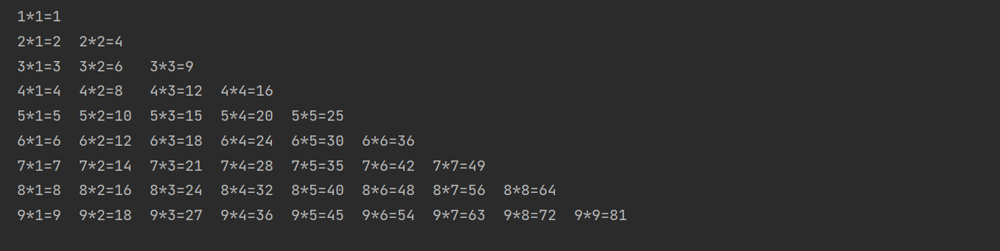
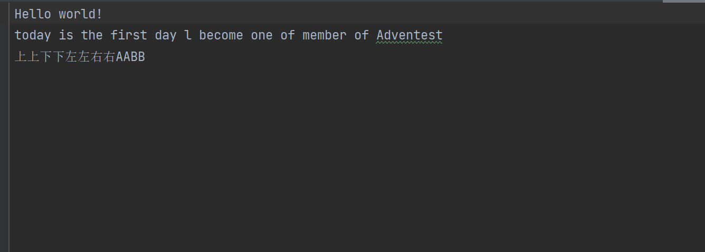
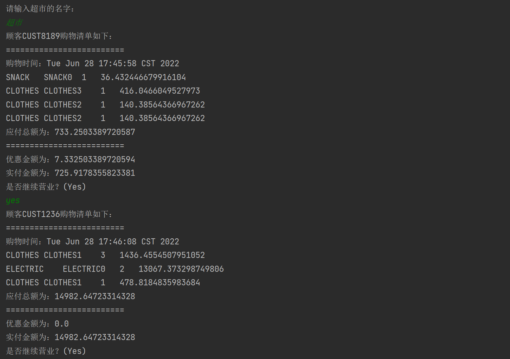
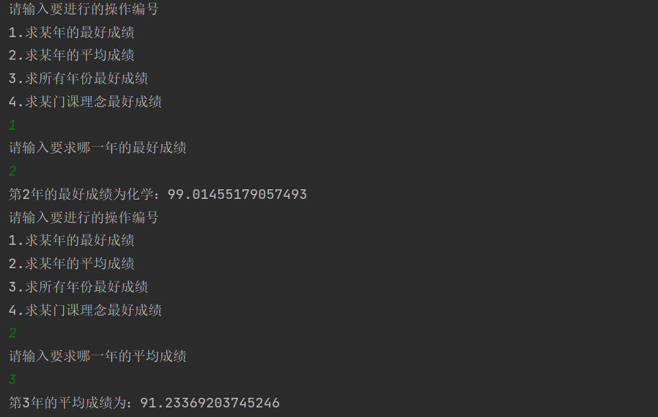
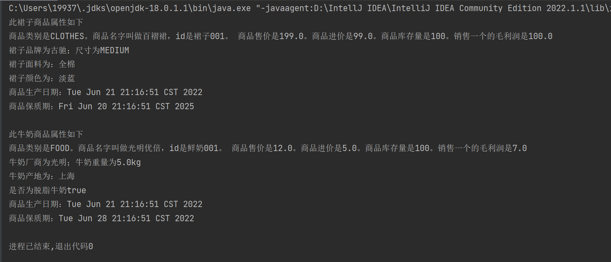

# week3作业
## a例程  
### 小超市中添加手机：
      
在同一个package里可以访问protected，继承的子类也能访问protected类
   
在不同package无法访问

但可以通过方法进行访问
### 定义商品门类

## b让商品更加丰富  
在supermarket中增加了新的商品
定义商品牛奶和裙子
其中裙子用到Size枚举来表示衣服尺寸
