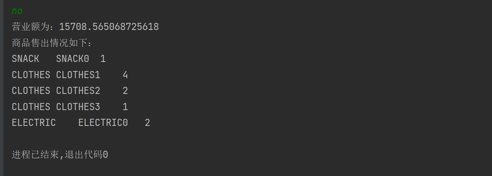

# week2 homework    
## a例程   
### 1.打造小超市   
程序路径在supermarket包下
    
### 2.构造方法     
程序路径在com.geekbang下     
     
    
### 3.AI程序
程序路径在com.geekbang.learn下     
    
## b程序
### 猜数字游戏（class version）    
程序路径在guessNumber包下     
